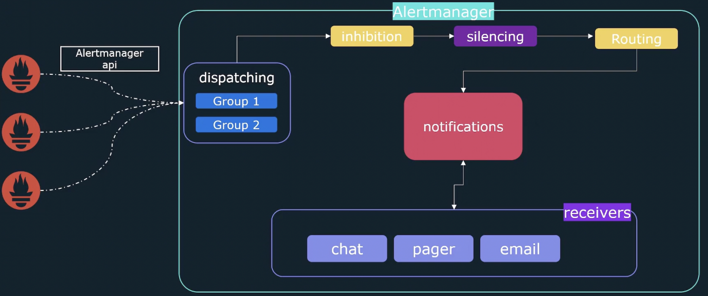

### Architecture

## Inhibition
Allows to supress some alerts if other alerts exists

## Silance
Allows to mute an alert, useful white doing maintenance on a server

## Routing
Define which alert is going though what integration, defines who is getting the alert